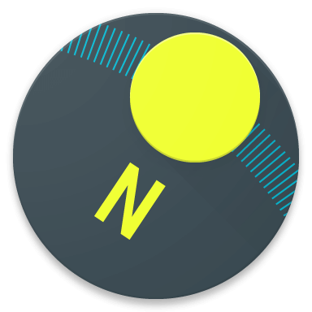

    
    <h1>Bompass</h1>

  A compact, beautiful compass app for Android

    
    

## Internationalization

[English](README.md) | [简体中文](README.zh-Hans.md)

## Introductions

This project is designed for the large number of systems that do not have the Compass app pre-installed. Google Play is flooded with a large number of complex functional Compass apps, and they often contain advertisements. Many users put up with these apps just for such a simple feature, so I wrote this little gadget that you just open and use, hoping it will help you.

## Features

* Simple interface and straightforward functions
* Compact size, with an installer size of no more than 37kb
* High compatibility, from Android 4.4 to the latest versions

## Acknowledgements

Thanks to the artist [UTL_1138](https://github.com/967018) for designing and drawing the pointer images and software icons for this project.

